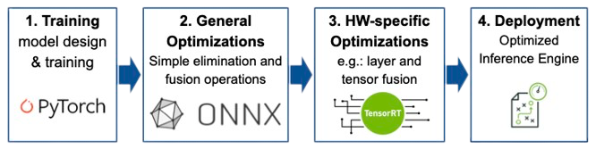
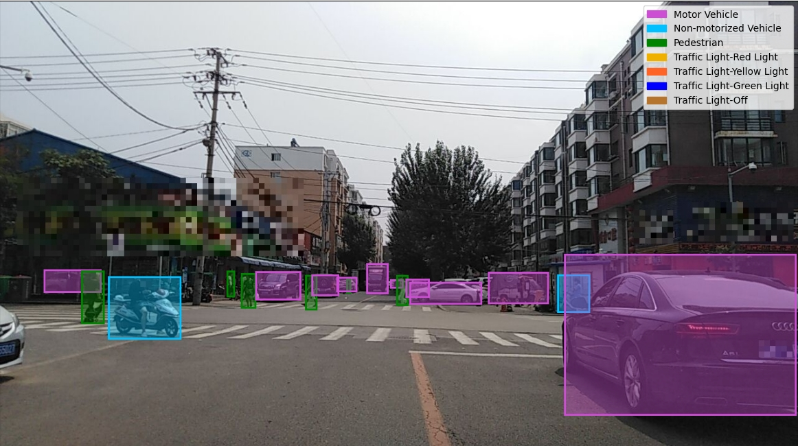

# Team: CapyNet (TU Munich, ETH Zurich)  
This is the submission repository of Team CapyNet to the System Design Contest of the 60th Design Automation Contest 2023.

For more information on the contest please check the website of the [2023 DAC System Design Contest](https://dac-sdc.github.io/2023/).

      

## Task

The DAC System Design Contest focuses on object detection and classification on an embedded GPU or FPGA system. Contestants will receive a training dataset provided by Baidu, and a hidden dataset will be used to evaluate the performance of the designs in terms of accuracy and speed.

      

## Usage

To run inference, add the images to the "images" folder and run "CapyNet.ipynb" in the [CapyNet](/CapyNet/) folder.

## Folder Structure

1. sample_team: This folder contains files for a sample team.  This includes a <teamname>.bit and <teamname>.tcl file that defines the hardware, and a `.ipynb` jupyter notebook, and a `hw` folder that is used to create a Vivado project.  You should create a new folder for your team, where you will keep all of your files.

2. images: All the test images are stored in this folder.  Add the data set or replace the example images in this directory with the full data set.

3. result: The results contain the output xml produced when execution is complete, and contains the runtime and predicted location of each object in each image.

## References
Part of the code and deployment flow are based on the following repositories. We thank their authors for open-sourcing their work:

* https://github.com/Senwang98/Lightweight-Detection-and-KD
* https://github.com/RangiLyu/nanodet
* https://github.com/daquexian/onnx-simplifier
* https://github.com/ZhangGe6/onnx-modifier

